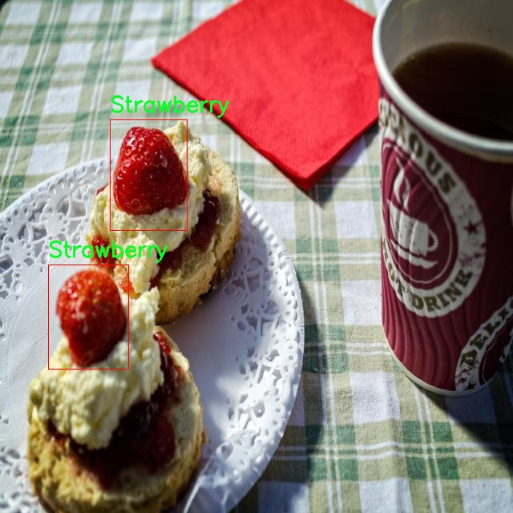

# 改进yolo11-cls等200+全套创新点大全：水果检测系统源码＆数据集全套

### 1.图片效果展示


##### 项目来源 **[人工智能促进会 2024.10.22](https://kdocs.cn/l/cszuIiCKVNis)**

##### 注意：由于项目一直在更新迭代，上面“1.图片效果展示”和“2.视频效果展示”展示的系统图片或者视频可能为老版本，新版本在老版本的基础上升级如下：（实际效果以升级的新版本为准）

  （1）适配了YOLOV11的“目标检测”模型和“实例分割”模型，通过加载相应的权重（.pt）文件即可自适应加载模型。

  （2）支持“图片识别”、“视频识别”、“摄像头实时识别”三种识别模式。

  （3）支持“图片识别”、“视频识别”、“摄像头实时识别”三种识别结果保存导出，解决手动导出（容易卡顿出现爆内存）存在的问题，识别完自动保存结果并导出到tempDir中。

  （4）支持Web前端系统中的标题、背景图等自定义修改。

  另外本项目提供训练的数据集和训练教程,暂不提供权重文件（best.pt）,需要您按照教程进行训练后实现图片演示和Web前端界面演示的效果。

### 2.视频效果展示

[2.1 视频效果展示](https://www.bilibili.com/video/BV1dbydYiE5S/)

### 3.背景

研究背景与意义

随着全球水果消费的不断增长，水果的种类和品种也日益丰富。然而，水果的种类繁多以及外观相似性使得传统的人工检测方法面临着效率低下和准确性不足的问题。因此，开发一种高效、准确的水果检测系统显得尤为重要。近年来，深度学习技术的迅猛发展为物体检测领域带来了新的机遇，尤其是YOLO（You Only Look Once）系列模型因其高效的实时检测能力而受到广泛关注。YOLOv11作为该系列的最新版本，结合了更为先进的特征提取和目标定位技术，能够在复杂环境中实现高精度的物体检测。

本研究旨在基于改进的YOLOv11模型，构建一个水果检测系统，以解决现有水果检测方法的不足。所使用的数据集“Allergic-fruit”包含3200张图像，涵盖了16种不同的水果类别，包括苹果、香蕉、蓝莓、哈密瓜、无花果、葡萄、柚子、柠檬、芒果、橙子、桃子、梨、菠萝、石榴、红莓和草莓等。这些丰富的样本数据为模型的训练和测试提供了坚实的基础，使得系统能够在多样化的水果检测任务中表现出色。

通过对YOLOv11模型的改进，结合数据集中的多样性和复杂性，本研究不仅可以提高水果检测的准确性和实时性，还能够为农业生产、食品安全以及智能零售等领域提供有力的技术支持。此外，水果检测系统的成功应用将推动智能视觉技术在其他领域的扩展，具有重要的理论价值和实际意义。通过本项目的实施，期望能够为未来的水果自动化识别和分类提供一种有效的解决方案，促进农业现代化和智能化的发展。

### 4.数据集信息展示

##### 4.1 本项目数据集详细数据（类别数＆类别名）

nc: 15
names: ['Apple', 'Banana', 'Cantaloupe', 'Common fig', 'Grape', 'Grapefruit', 'Lemon', 'Mango', 'Orange', 'Peach', 'Pear', 'Pineapple', 'Pomegranate', 'Strawberry', 'Watermelon']


该项目为【目标检测】数据集，请在【训练教程和Web端加载模型教程（第三步）】这一步的时候按照【目标检测】部分的教程来训练

##### 4.2 本项目数据集信息介绍

本项目数据集信息介绍

本项目所使用的数据集名为“Allergic-fruit”，其主要目的是为了改进YOLOv11的水果检测系统，以实现更高效、更准确的水果识别与分类。该数据集包含15个不同的水果类别，具体包括苹果、香蕉、哈密瓜、无花果、葡萄、葡萄柚、柠檬、芒果、橙子、桃子、梨子、菠萝、石榴、草莓和西瓜。这些水果的选择不仅涵盖了常见的热带和温带水果，还考虑到了不同地区的饮食习惯和市场需求，从而确保数据集的多样性和广泛适用性。

在数据集的构建过程中，特别注重了样本的质量和数量，以保证模型在训练时能够获得丰富的特征信息。每个类别的水果样本均经过精心挑选，确保其在形态、颜色和纹理等方面具有代表性。此外，数据集中还包含了不同环境和光照条件下的水果图像，以提高模型的鲁棒性和适应性。这种多样化的样本设计不仅能够帮助模型学习到更为细致的特征，还能有效降低因环境变化带来的识别误差。

通过使用“Allergic-fruit”数据集，我们希望能够训练出一个能够准确识别和分类多种水果的YOLOv11模型。这一模型的成功实现，将为水果相关的应用场景提供强有力的技术支持，例如智能购物、食品安全监测以及农业生产管理等领域。最终，我们期望通过本项目的研究，推动水果检测技术的发展，为相关行业带来更高的效率和更好的用户体验。





### 5.全套项目环境部署视频教程（零基础手把手教学）

[5.1 所需软件PyCharm和Anaconda安装教程（第一步）](https://www.bilibili.com/video/BV1BoC1YCEKi/?spm_id_from=333.999.0.0&vd_source=bc9aec86d164b67a7004b996143742dc)


[5.2 安装Python虚拟环境创建和依赖库安装视频教程（第二步）](https://www.bilibili.com/video/BV1ZoC1YCEBw?spm_id_from=333.788.videopod.sections&vd_source=bc9aec86d164b67a7004b996143742dc)

### 6.改进YOLOv11训练教程和Web_UI前端加载模型教程（零基础手把手教学）

[6.1 改进YOLOv11训练教程和Web_UI前端加载模型教程（第三步）](https://www.bilibili.com/video/BV1BoC1YCEhR?spm_id_from=333.788.videopod.sections&vd_source=bc9aec86d164b67a7004b996143742dc)


按照上面的训练视频教程链接加载项目提供的数据集，运行train.py即可开始训练



     Epoch   gpu_mem       box       obj       cls    labels  img_size
     1/200     20.8G   0.01576   0.01955  0.007536        22      1280: 100%|██████████| 849/849 [14:42<00:00,  1.04s/it]
               Class     Images     Labels          P          R     mAP@.5 mAP@.5:.95: 100%|██████████| 213/213 [01:14<00:00,  2.87it/s]
                 all       3395      17314      0.994      0.957      0.0957      0.0843

     Epoch   gpu_mem       box       obj       cls    labels  img_size
     2/200     20.8G   0.01578   0.01923  0.007006        22      1280: 100%|██████████| 849/849 [14:44<00:00,  1.04s/it]
               Class     Images     Labels          P          R     mAP@.5 mAP@.5:.95: 100%|██████████| 213/213 [01:12<00:00,  2.95it/s]
                 all       3395      17314      0.996      0.956      0.0957      0.0845

     Epoch   gpu_mem       box       obj       cls    labels  img_size
     3/200     20.8G   0.01561    0.0191  0.006895        27      1280: 100%|██████████| 849/849 [10:56<00:00,  1.29it/s]
               Class     Images     Labels          P          R     mAP@.5 mAP@.5:.95: 100%|███████   | 187/213 [00:52<00:00,  4.04it/s]
                 all       3395      17314      0.996      0.957      0.0957      0.0845


###### [项目数据集下载链接](https://kdocs.cn/l/cszuIiCKVNis)

### 7.原始YOLOv11算法讲解


ultralytics发布了最新的作品YOLOv11，这一次YOLOv11的变化相对于ultralytics公司的上一代作品YOLOv8变化不是很大的（YOLOv9、YOLOv10均不是ultralytics公司作品），其中改变的位置涉及到C2f变为C3K2，在SPPF后面加了一层类似于注意力机制的C2PSA，还有一个变化大家从yaml文件是看不出来的就是它的检测头内部替换了两个DWConv，以及模型的深度和宽度参数进行了大幅度调整，但是在损失函数方面就没有变化还是采用的CIoU作为边界框回归损失，下面带大家深入理解一下ultralytics最新作品YOLOv11的创新点。

**下图为最近的YOLO系列发布时间线！**


* * *

###### YOLOv11和YOLOv8对比

在YOLOYOLOv5，YOLOv8，和YOLOv11是ultralytics公司作品（ultralytics出品必属精品），下面用一张图片从yaml文件来带大家对比一下YOLOv8和YOLOv11的区别，配置文件变得内容比较少大家可以看一卡，左侧为YOLOv8右侧为YOLOv11，不同的点我用黑线标注了出来。


* * *

###### YOLOv11的网络结构解析

下面的图片为YOLOv11的网络结构图。


**其中主要创新点可以总结如下- > **

* * *

1\.
提出C3k2机制，其中C3k2有参数为c3k，其中在网络的浅层c3k设置为False（下图中可以看到c3k2第二个参数被设置为False，就是对应的c3k参数）。


此时所谓的C3k2就相当于YOLOv8中的C2f，其网络结构为一致的，其中的C3k机制的网络结构图如下图所示
**（为什么叫C3k2，我个人理解是因为C3k的调用时C3k其中的参数N固定设置为2的原因，个人理解不一定对** ）。


* * *

2\.
第二个创新点是提出C2PSA机制，这是一个C2（C2f的前身）机制内部嵌入了一个多头注意力机制，在这个过程中我还发现作者尝试了C2fPSA机制但是估计效果不如C2PSA，有的时候机制有没有效果理论上真的很难解释通，下图为C2PSA机制的原理图，仔细观察把Attention哪里去掉则C2PSA机制就变为了C2所以我上面说C2PSA就是C2里面嵌入了一个PSA机制。


* * *

3\.
第三个创新点可以说是原先的解耦头中的分类检测头增加了两个DWConv，具体的对比大家可以看下面两个图下面的是YOLOv11的解耦头，上面的是YOLOv8的解耦头.


我们上面看到了在分类检测头中YOLOv11插入了两个DWConv这样的做法可以大幅度减少参数量和计算量（原先两个普通的Conv大家要注意到卷积和是由3变为了1的，这是形成了两个深度可分离Conv），大家可能不太理解为什么加入了两个DWConv还能够减少计算量，以及什么是深度可分离Conv，下面我来解释一下。

> **`DWConv` 代表 Depthwise
> Convolution（深度卷积）**，是一种在卷积神经网络中常用的高效卷积操作。它主要用于减少计算复杂度和参数量，尤其在移动端或轻量化网络（如
> MobileNet）中十分常见。
>
> **1\. 标准卷积的计算过程**
>
> 在标准卷积操作中，对于一个输入张量（通常是一个多通道的特征图），卷积核的尺寸是 `(h, w, C_in)`，其中 `h` 和 `w`
> 是卷积核的空间尺寸，`C_in`
> 是输入通道的数量。而卷积核与输入张量做的是完整的卷积运算，每个输出通道都与所有输入通道相连并参与卷积操作，导致计算量比较大。
>
> 标准卷积的计算过程是这样的：
>
>   * 每个输出通道是所有输入通道的组合（加权求和），卷积核在每个位置都会计算与所有输入通道的点积。
>   * 假设有 `C_in` 个输入通道和 `C_out` 个输出通道，那么卷积核的总参数量是 `C_in * C_out * h * w`。
>

>
> 2\. **Depthwise Convolution（DWConv）**
>
> 与标准卷积不同， **深度卷积** 将输入的每个通道单独处理，即 **每个通道都有自己的卷积核进行卷积**
> ，不与其他通道进行交互。它可以被看作是标准卷积的一部分，专注于空间维度上的卷积运算。
>
> **深度卷积的计算过程：**
>
>   * 假设输入张量有 `C_in` 个通道，每个通道会使用一个 `h × w`
> 的卷积核进行卷积操作。这个过程称为“深度卷积”，因为每个通道独立进行卷积运算。
>   * 输出的通道数与输入通道数一致，每个输出通道只和对应的输入通道进行卷积，没有跨通道的组合。
>   * 参数量和计算量相比标准卷积大大减少，卷积核的参数量是 `C_in * h * w`。
>

>
> **深度卷积的优点：**
>
>   1. **计算效率高** ：相对于标准卷积，深度卷积显著减少了计算量。它只处理空间维度上的卷积，不再处理通道间的卷积。
>   2.  **参数量减少** ：由于每个卷积核只对单个通道进行卷积，参数量大幅减少。例如，标准卷积的参数量为 `C_in * C_out * h *
> w`，而深度卷积的参数量为 `C_in * h * w`。
>   3.  **结合点卷积可提升效果** ：为了弥补深度卷积缺乏跨通道信息整合的问题，通常深度卷积后会配合 `1x1` 的点卷积（Pointwise
> Convolution）使用，通过 `1x1` 的卷积核整合跨通道的信息。这种组合被称为 **深度可分离卷积** （Depthwise
> Separable Convolution） | **这也是我们本文YOLOv11中的做法** 。
>

>
> 3\. **深度卷积与标准卷积的区别**
>
> 操作类型| 卷积核大小| 输入通道数| 输出通道数| 参数量  
> ---|---|---|---|---  
> 标准卷积| `h × w`| `C_in`| `C_out`| `C_in * C_out * h * w`  
> 深度卷积（DWConv）| `h × w`| `C_in`| `C_in`| `C_in * h * w`  
>  
> 可以看出，深度卷积在相同的卷积核大小下，参数量减少了约 `C_out` 倍
> （细心的人可以发现用最新版本的ultralytics仓库运行YOLOv8参数量相比于之前的YOLOv8以及大幅度减少了这就是因为检测头改了的原因但是名字还是Detect，所以如果你想继续用YOLOv8发表论文做实验那么不要更新最近的ultralytics仓库）。
>
> **4\. 深度可分离卷积 (Depthwise Separable Convolution)**
>
> 深度卷积常与 `1x1` 的点卷积配合使用，这称为深度可分离卷积。其过程如下：
>
>   1. 先对输入张量进行深度卷积，对每个通道独立进行空间卷积。
>   2. 然后通过 `1x1` 点卷积，对通道维度进行混合，整合不同通道的信息。
>

>
> 这样既可以保证计算量的减少，又可以保持跨通道的信息流动。
>
> 5\. **总结**
>
> `DWConv` 是一种高效的卷积方式，通过单独处理每个通道来减少计算量，结合 `1x1`
> 的点卷积，形成深度可分离卷积，可以在保持网络性能的同时极大地减少模型的计算复杂度和参数量。

**看到这里大家应该明白了为什么加入了两个DWConv还能减少参数量以及YOLOv11的检测头创新点在哪里。**

* * *

##### YOLOv11和YOLOv8还有一个不同的点就是其各个版本的模型（N - S - M- L - X）网络深度和宽度变了


可以看到在深度（depth）和宽度
（width）两个地方YOLOv8和YOLOv11是基本上完全不同了，这里我理解这么做的含义就是模型网络变小了，所以需要加深一些模型的放缩倍数来弥补模型之前丧失的能力从而来达到一个平衡。

> **本章总结：**
> YOLOv11的改进点其实并不多更多的都是一些小的结构上的创新，相对于之前的YOLOv5到YOLOv8的创新，其实YOLOv11的创新点不算多，但是其是ultralytics公司的出品，同时ultralytics仓库的使用量是非常多的（不像YOLOv9和YOLOv10）所以在未来的很长一段时间内其实YOLO系列估计不会再更新了，YOLOv11作为最新的SOTA肯定是十分适合大家来发表论文和创新的。
>

### 8.200+种全套改进YOLOV11创新点原理讲解

#### 8.1 200+种全套改进YOLOV11创新点原理讲解大全

由于篇幅限制，每个创新点的具体原理讲解就不全部展开，具体见下列网址中的改进模块对应项目的技术原理博客网址【Blog】（创新点均为模块化搭建，原理适配YOLOv5~YOLOv11等各种版本）

[改进模块技术原理博客【Blog】网址链接](https://gitee.com/qunmasj/good)


#### 8.2 精选部分改进YOLOV11创新点原理讲解

###### 这里节选部分改进创新点展开原理讲解(完整的改进原理见上图和[改进模块技术原理博客链接](https://gitee.com/qunmasj/good)【如果此小节的图加载失败可以通过CSDN或者Github搜索该博客的标题访问原始博客，原始博客图片显示正常】


### LSKNet的架构
该博客提出的结构层级依次为：

LSK module（大核卷积序列+空间选择机制） < LSK Block （LK Selection + FFN）<LSKNet（N个LSK Block）


#### LSK 模块

LSK Block
LSKNet 是主干网络中的一个可重复堆叠的块（Block），每个LSK Block包括两个残差子块，即大核选择子块（Large Kernel Selection，LK Selection）和前馈网络子块（Feed-forward Network ，FFN），如图8。LK Selection子块根据需要动态地调整网络的感受野，FFN子块用于通道混合和特征细化，由一个全连接层、一个深度卷积、一个 GELU 激活和第二个全连接层组成。

LSK module（LSK 模块，图4）由一个大核卷积序列（large kernel convolutions）和一个空间核选择机制（spatial kernel selection mechanism）组成，被嵌入到了LSK Block 的 LK Selection子块中。

#### Large Kernel Convolutions
因为不同类型的目标对背景信息的需求不同，这就需要模型能够自适应选择不同大小的背景范围。因此，作者通过解耦出一系列具有大卷积核、且不断扩张的Depth-wise 卷积，构建了一个更大感受野的网络。

具体地，假设序列中第i个Depth-wise 卷积核的大小为 ，扩张率为 d，感受野为 ，它们满足以下关系：


卷积核大小和扩张率的增加保证了感受野能够快速增大。此外，我们设置了扩张率的上限，以保证扩张卷积不会引入特征图之间的差距。


Table2的卷积核大小可根据公式（1）和（2）计算，详见下图：


这样设计的好处有两点。首先，能够产生具有多种不同大小感受野的特征，便于后续的核选择；第二，序列解耦比简单的使用一个大型卷积核效果更好。如上图表2所示，解耦操作相对于标准的大型卷积核，有效地将低了模型的参数量。

为了从输入数据  的不同区域获取丰富的背景信息特征，可采用一系列解耦的、不用感受野的Depth-wise 卷积核：


其中，是卷积核为 、扩张率为  的Depth-wise 卷积操作。假设有个解耦的卷积核，每个卷积操作后又要经过一个的卷积层进行空间特征向量的通道融合。


之后，针对不同的目标，可基于获取的多尺度特征，通过下文中的选择机制动态选择合适的卷积核大小。

这一段的意思可以简单理解为：

把一个大的卷积核拆成了几个小的卷积核，比如一个大小为5，扩张率为1的卷积核加上一个大小为7，扩张率为3的卷积核，感受野为23，与一个大小为23，扩张率为1的卷积核的感受野是一样的。因此可用两个小的卷积核替代一个大的卷积核，同理一个大小为29的卷积核也可以用三个小的卷积代替（Table 2），这样可以有效的减少参数，且更灵活。

将输入数据依次通过这些小的卷积核（公式3），并在每个小的卷积核后面接上一个1×1的卷积进行通道融合（公式4）。

#### Spatial Kernel Selection
为了使模型更关注目标在空间上的重点背景信息，作者使用空间选择机制从不同尺度的大卷积核中对特征图进行空间选择。

首先，将来自于不同感受野卷积核的特征进行concate拼接，然后，应用通道级的平均池化和最大池化提取空间关系，其中， 和  是平均池化和最大池化后的空间特征描述符。为了实现不同空间描述符的信息交互，作者利用卷积层将空间池化特征进行拼接，将2个通道的池化特征转换为N个空间注意力特征图，之后，将Sigmoid激活函数应用到每一个空间注意力特征图，可获得每个解耦的大卷积核所对应的独立的空间选择掩膜，又然后，将解耦后的大卷积核序列的特征与对应的空间选择掩膜进行加权处理，并通过卷积层进行融合获得注意力特征 ，最后LSK module的输出可通过输入特征  与注意力特征  的逐元素点成获得，公式对应于结构图上的操作如下：


### 9.系统功能展示

图9.1.系统支持检测结果表格显示

  图9.2.系统支持置信度和IOU阈值手动调节

  图9.3.系统支持自定义加载权重文件best.pt(需要你通过步骤5中训练获得)

  图9.4.系统支持摄像头实时识别

  图9.5.系统支持图片识别

  图9.6.系统支持视频识别

  图9.7.系统支持识别结果文件自动保存

  图9.8.系统支持Excel导出检测结果数据


### 10. YOLOv11核心改进源码讲解

#### 10.1 head.py

以下是对代码的逐文件分析，保留了最核心的部分，并对代码进行了详细的中文注释。

```python
import torch
import torch.nn as nn
import torch.nn.functional as F
from ..modules import Conv, DFL, make_anchors, dist2bbox

class Detect_DyHead(nn.Module):
    """YOLOv8 检测头，使用动态头进行检测模型。"""
    
    def __init__(self, nc=80, hidc=256, block_num=2, ch=()):
        """
        初始化检测层。
        
        参数:
        nc (int): 类别数量。
        hidc (int): 隐藏层通道数。
        block_num (int): 动态头块的数量。
        ch (tuple): 输入通道数。
        """
        super().__init__()
        self.nc = nc  # 类别数量
        self.nl = len(ch)  # 检测层数量
        self.reg_max = 16  # DFL 通道数
        self.no = nc + self.reg_max * 4  # 每个锚点的输出数量
        self.stride = torch.zeros(self.nl)  # 构建时计算的步幅
        self.conv = nn.ModuleList(nn.Sequential(Conv(x, hidc, 1)) for x in ch)  # 卷积层
        self.dyhead = nn.Sequential(*[DyHeadBlock(hidc) for _ in range(block_num)])  # 动态头块
        self.cv2 = nn.ModuleList(
            nn.Sequential(Conv(hidc, 3, 3), nn.Conv2d(3, 4 * self.reg_max, 1)) for _ in ch)  # 生成边界框的卷积层
        self.cv3 = nn.ModuleList(
            nn.Sequential(
                nn.Conv2d(hidc, self.nc, 1)  # 分类卷积层
            ) for _ in ch
        )
        self.dfl = DFL(self.reg_max) if self.reg_max > 1 else nn.Identity()  # DFL层

    def forward(self, x):
        """连接并返回预测的边界框和类别概率。"""
        for i in range(self.nl):
            x[i] = self.conv[i](x[i])  # 通过卷积层处理输入
        x = self.dyhead(x)  # 通过动态头处理
        shape = x[0].shape  # 获取输出形状
        for i in range(self.nl):
            x[i] = torch.cat((self.cv2[i](x[i]), self.cv3[i](x[i])), 1)  # 连接边界框和类别输出
        x_cat = torch.cat([xi.view(shape[0], self.no, -1) for xi in x], 2)  # 合并所有输出
        box, cls = x_cat.split((self.reg_max * 4, self.nc), 1)  # 分割边界框和类别
        dbox = dist2bbox(self.dfl(box), self.anchors.unsqueeze(0), xywh=True, dim=1) * self.strides  # 解码边界框
        return torch.cat((dbox, cls.sigmoid()), 1)  # 返回边界框和类别概率

    def bias_init(self):
        """初始化检测头的偏置，警告：需要步幅可用。"""
        for a, b, s in zip(self.cv2, self.cv3, self.stride):
            a[-1].bias.data[:] = 1.0  # 边界框偏置
            b[-1].bias.data[:self.nc] = math.log(5 / self.nc / (640 / s) ** 2)  # 类别偏置

# 其他检测头类的实现类似，省略细节
```

### 代码分析总结：
1. **Detect_DyHead 类**：实现了 YOLOv8 的检测头，包含了动态头块和用于生成边界框和类别的卷积层。
2. **初始化方法**：设置了类别数量、通道数、卷积层等参数。
3. **前向传播方法**：处理输入，生成边界框和类别概率，并返回最终结果。
4. **偏置初始化方法**：初始化边界框和类别的偏置，确保模型在训练时能够有效学习。

其他检测头类（如 `Detect_AFPN_P345`, `Detect_Efficient` 等）也遵循类似的结构和逻辑，主要区别在于使用的卷积层和处理方式。

这个文件 `head.py` 是一个用于 YOLOv8 模型的检测头的实现，主要包含了多个检测头的类定义，旨在处理目标检测任务。文件中使用了 PyTorch 框架，并且通过模块化的方式实现了不同的检测头，以适应不同的需求和模型结构。

首先，文件引入了一些必要的库和模块，包括数学库、深度学习框架 PyTorch 及其相关模块、以及一些自定义的模块和函数。`__all__` 变量定义了该模块的公共接口，列出了可以被外部导入的类。

接下来，定义了多个检测头类，每个类都继承自 `nn.Module`，实现了目标检测的功能。以下是一些主要类的概述：

1. **Detect_DyHead**：这是一个基于动态头的检测模块，支持多层次的特征图输入。它通过卷积层和动态头块进行特征提取，并在前向传播中生成边界框和类别概率。该类还包含了锚框的生成和形状的动态调整。

2. **Detect_AFPN_P345** 和 **Detect_AFPN_P2345**：这两个类实现了基于自适应特征金字塔网络（AFPN）的检测头，分别支持不同层次的特征输入。它们通过卷积层和 AFPN 结构来增强特征提取能力。

3. **Detect_Efficient**：这是一个高效的检测头，设计上更为轻量，适合在资源受限的环境中使用。它使用了组卷积和深度卷积来减少计算量。

4. **DetectAux**：这个类实现了一个辅助检测头，支持多层次的特征输入，并且在训练时可以输出多个检测结果。

5. **Detect_LSCD** 和 **Detect_LSCSBD**：这些类实现了轻量级共享卷积的检测头，旨在减少模型的参数量和计算量，同时保持较好的检测性能。

6. **Detect_TADDH**：这个类实现了任务动态对齐检测头，使用了任务分解的思想，通过共享卷积和动态卷积来提高检测精度。

7. **Segment_Efficient**、**Pose_LSCD**、**OBB_LSCD** 等类则分别实现了针对分割、姿态估计和旋转边界框检测的头，展示了该框架的灵活性和可扩展性。

每个类的 `forward` 方法实现了前向传播逻辑，负责将输入特征图经过各层卷积处理后输出最终的边界框和类别概率。文件中还包含了一些辅助方法，如 `bias_init` 用于初始化偏置，`decode_bboxes` 用于解码边界框等。

总的来说，这个文件通过定义多个检测头类，提供了一个灵活且可扩展的目标检测框架，适用于不同的任务和需求。

#### 10.2 kacn_conv.py

以下是代码中最核心的部分，并附上详细的中文注释：

```python
import torch
import torch.nn as nn

class KACNConvNDLayer(nn.Module):
    def __init__(self, conv_class, norm_class, input_dim, output_dim, degree, kernel_size,
                 groups=1, padding=0, stride=1, dilation=1,
                 ndim: int = 2, dropout=0.0):
        super(KACNConvNDLayer, self).__init__()
        
        # 初始化输入和输出维度、卷积参数等
        self.inputdim = input_dim
        self.outdim = output_dim
        self.degree = degree
        self.kernel_size = kernel_size
        self.padding = padding
        self.stride = stride
        self.dilation = dilation
        self.groups = groups
        self.ndim = ndim
        
        # 初始化dropout层
        self.dropout = None
        if dropout > 0:
            if ndim == 1:
                self.dropout = nn.Dropout1d(p=dropout)
            elif ndim == 2:
                self.dropout = nn.Dropout2d(p=dropout)
            elif ndim == 3:
                self.dropout = nn.Dropout3d(p=dropout)

        # 检查groups参数的有效性
        if groups <= 0:
            raise ValueError('groups must be a positive integer')
        if input_dim % groups != 0:
            raise ValueError('input_dim must be divisible by groups')
        if output_dim % groups != 0:
            raise ValueError('output_dim must be divisible by groups')

        # 为每个组创建归一化层
        self.layer_norm = nn.ModuleList([norm_class(output_dim // groups) for _ in range(groups)])

        # 创建多项式卷积层
        self.poly_conv = nn.ModuleList([conv_class((degree + 1) * input_dim // groups,
                                                   output_dim // groups,
                                                   kernel_size,
                                                   stride,
                                                   padding,
                                                   dilation,
                                                   groups=1,
                                                   bias=False) for _ in range(groups)])
        
        # 注册一个缓冲区，用于存储一个范围的张量
        arange_buffer_size = (1, 1, -1,) + tuple(1 for _ in range(ndim))
        self.register_buffer("arange", torch.arange(0, degree + 1, 1).view(*arange_buffer_size))
        
        # 使用Kaiming均匀分布初始化卷积层的权重
        for conv_layer in self.poly_conv:
            nn.init.normal_(conv_layer.weight, mean=0.0, std=1 / (input_dim * (degree + 1) * kernel_size ** ndim))

    def forward_kacn(self, x, group_index):
        # 对输入进行处理并通过对应的卷积层进行前向传播
        x = torch.tanh(x)  # 应用tanh激活函数
        x = x.acos().unsqueeze(2)  # 计算反余弦并增加一个维度
        x = (x * self.arange).flatten(1, 2)  # 进行张量变换
        x = x.cos()  # 计算余弦
        x = self.poly_conv[group_index](x)  # 通过多项式卷积层
        x = self.layer_norm[group_index](x)  # 进行层归一化
        if self.dropout is not None:
            x = self.dropout(x)  # 应用dropout
        return x

    def forward(self, x):
        # 将输入按组分割并进行前向传播
        split_x = torch.split(x, self.inputdim // self.groups, dim=1)
        output = []
        for group_ind, _x in enumerate(split_x):
            y = self.forward_kacn(_x.clone(), group_ind)  # 对每个组进行处理
            output.append(y.clone())
        y = torch.cat(output, dim=1)  # 将所有组的输出拼接
        return y
```

### 代码核心部分解释：
1. **KACNConvNDLayer类**：这是一个自定义的神经网络层，支持多维卷积（1D、2D、3D），并实现了多项式卷积和层归一化。
2. **初始化方法**：接收多个参数以配置卷积层、归一化层、dropout等，并进行必要的参数检查。
3. **forward_kacn方法**：实现了该层的前向传播逻辑，包括激活函数、张量变换和卷积操作。
4. **forward方法**：将输入数据按组分割，分别通过`forward_kacn`处理，然后将结果拼接在一起返回。

这个程序文件定义了一个名为 `kacn_conv.py` 的深度学习模块，主要实现了一个自定义的卷积层，名为 `KACNConvNDLayer`，以及其在一维、二维和三维卷积的具体实现类。以下是对代码的详细说明。

首先，程序导入了 PyTorch 库及其神经网络模块。`KACNConvNDLayer` 类是一个通用的卷积层，可以处理任意维度的输入数据。它的构造函数接受多个参数，包括卷积类、归一化类、输入和输出维度、卷积核大小、分组数、填充、步幅、扩张率、维度数量和 dropout 概率等。

在构造函数中，首先对输入参数进行初始化，并检查分组数、输入维度和输出维度的有效性。接着，根据指定的维度数量（ndim），如果 dropout 概率大于零，则初始化相应的 dropout 层。然后，创建了一个模块列表 `layer_norm`，用于存储每个分组的归一化层，和一个模块列表 `poly_conv`，用于存储每个分组的卷积层。卷积层的数量由分组数决定，每个卷积层的输入通道数为 `(degree + 1) * input_dim // groups`，输出通道数为 `output_dim // groups`。

此外，程序还注册了一个缓冲区 `arange`，用于存储从 0 到 `degree` 的一维张量，形状为 `(1, 1, -1, ...)`，以便在前向传播中使用。最后，使用 Kaiming 正态分布初始化卷积层的权重，以提高训练的起始效果。

`forward_kacn` 方法实现了前向传播的具体逻辑。它首先对输入进行双曲正切激活，然后进行反余弦变换并扩展维度，接着与 `arange` 张量相乘并展平，最后通过对应的卷积层和归一化层进行处理。如果设置了 dropout，则在输出之前应用 dropout。

`forward` 方法则是对输入进行分组处理，分别调用 `forward_kacn` 方法进行计算，并将所有分组的输出拼接在一起，形成最终的输出。

接下来的三个类 `KACNConv3DLayer`、`KACNConv2DLayer` 和 `KACNConv1DLayer` 分别继承自 `KACNConvNDLayer`，用于实现三维、二维和一维卷积的具体实现。它们在构造函数中调用父类的构造函数，并传入相应的卷积和归一化类（如 `nn.Conv3d`、`nn.Conv2d` 和 `nn.Conv1d`），以便创建适用于不同维度的卷积层。

总体而言，这个文件实现了一个灵活且可扩展的卷积层结构，能够适应不同维度的输入数据，并结合了多项式卷积和归一化操作，适用于复杂的深度学习任务。

#### 10.3 fasternet.py

以下是经过简化并添加详细中文注释的核心代码部分：

```python
import torch
import torch.nn as nn
from typing import List
from torch import Tensor

class Partial_conv3(nn.Module):
    """部分卷积层，用于在训练和推理中处理输入特征图。"""

    def __init__(self, dim, n_div, forward):
        super().__init__()
        self.dim_conv3 = dim // n_div  # 部分卷积的通道数
        self.dim_untouched = dim - self.dim_conv3  # 未被卷积处理的通道数
        self.partial_conv3 = nn.Conv2d(self.dim_conv3, self.dim_conv3, 3, 1, 1, bias=False)  # 定义卷积层

        # 根据forward类型选择前向传播方式
        if forward == 'slicing':
            self.forward = self.forward_slicing
        elif forward == 'split_cat':
            self.forward = self.forward_split_cat
        else:
            raise NotImplementedError

    def forward_slicing(self, x: Tensor) -> Tensor:
        """推理时的前向传播，只处理部分通道。"""
        x = x.clone()  # 克隆输入以保留原始输入
        x[:, :self.dim_conv3, :, :] = self.partial_conv3(x[:, :self.dim_conv3, :, :])  # 处理部分通道
        return x

    def forward_split_cat(self, x: Tensor) -> Tensor:
        """训练和推理时的前向传播，处理部分通道并拼接未处理的通道。"""
        x1, x2 = torch.split(x, [self.dim_conv3, self.dim_untouched], dim=1)  # 按通道分割
        x1 = self.partial_conv3(x1)  # 处理部分通道
        x = torch.cat((x1, x2), 1)  # 拼接处理后的通道和未处理的通道
        return x


class MLPBlock(nn.Module):
    """多层感知机块，用于特征变换。"""

    def __init__(self, dim, n_div, mlp_ratio, drop_path, layer_scale_init_value, act_layer, norm_layer, pconv_fw_type):
        super().__init__()
        self.dim = dim
        self.mlp_ratio = mlp_ratio
        self.drop_path = nn.Identity() if drop_path <= 0 else nn.Dropout(drop_path)  # 随机丢弃层
        self.n_div = n_div

        mlp_hidden_dim = int(dim * mlp_ratio)  # MLP隐藏层维度

        # 定义MLP结构
        mlp_layer: List[nn.Module] = [
            nn.Conv2d(dim, mlp_hidden_dim, 1, bias=False),
            norm_layer(mlp_hidden_dim),
            act_layer(),
            nn.Conv2d(mlp_hidden_dim, dim, 1, bias=False)
        ]
        self.mlp = nn.Sequential(*mlp_layer)  # 将MLP层组合成序列

        # 定义空间混合层
        self.spatial_mixing = Partial_conv3(dim, n_div, pconv_fw_type)

        # 如果层缩放初始化值大于0，则定义层缩放
        if layer_scale_init_value > 0:
            self.layer_scale = nn.Parameter(layer_scale_init_value * torch.ones((dim)), requires_grad=True)
            self.forward = self.forward_layer_scale  # 使用层缩放的前向传播
        else:
            self.forward = self.forward  # 默认前向传播

    def forward(self, x: Tensor) -> Tensor:
        """前向传播，返回经过MLP变换的特征。"""
        shortcut = x  # 保留输入用于残差连接
        x = self.spatial_mixing(x)  # 通过空间混合层
        x = shortcut + self.drop_path(self.mlp(x))  # 残差连接
        return x

    def forward_layer_scale(self, x: Tensor) -> Tensor:
        """使用层缩放的前向传播。"""
        shortcut = x
        x = self.spatial_mixing(x)
        x = shortcut + self.drop_path(self.layer_scale.unsqueeze(-1).unsqueeze(-1) * self.mlp(x))  # 残差连接与层缩放
        return x


class FasterNet(nn.Module):
    """FasterNet模型，包含多个阶段和特征提取模块。"""

    def __init__(self, in_chans=3, num_classes=1000, embed_dim=96, depths=(1, 2, 8, 2), mlp_ratio=2., n_div=4,
                 patch_size=4, patch_stride=4, patch_size2=2, patch_stride2=2, patch_norm=True, drop_path_rate=0.1,
                 layer_scale_init_value=0, norm_layer='BN', act_layer='RELU', pconv_fw_type='split_cat'):
        super().__init__()

        # 选择归一化层和激活函数
        norm_layer = nn.BatchNorm2d if norm_layer == 'BN' else NotImplementedError
        act_layer = nn.GELU if act_layer == 'GELU' else partial(nn.ReLU, inplace=True)

        self.num_stages = len(depths)  # 模型阶段数
        self.embed_dim = embed_dim  # 嵌入维度
        self.mlp_ratio = mlp_ratio  # MLP比率

        # 图像分块嵌入
        self.patch_embed = PatchEmbed(patch_size=patch_size, patch_stride=patch_stride, in_chans=in_chans,
                                       embed_dim=embed_dim, norm_layer=norm_layer if patch_norm else None)

        # 随机深度衰减规则
        dpr = [x.item() for x in torch.linspace(0, drop_path_rate, sum(depths))]

        # 构建各个阶段
        stages_list = []
        for i_stage in range(self.num_stages):
            stage = BasicStage(dim=int(embed_dim * 2 ** i_stage), n_div=n_div, depth=depths[i_stage],
                               mlp_ratio=self.mlp_ratio, drop_path=dpr[sum(depths[:i_stage]):sum(depths[:i_stage + 1])],
                               layer_scale_init_value=layer_scale_init_value, norm_layer=norm_layer,
                               act_layer=act_layer, pconv_fw_type=pconv_fw_type)
            stages_list.append(stage)

            # 添加分块合并层
            if i_stage < self.num_stages - 1:
                stages_list.append(PatchMerging(patch_size2=patch_size2, patch_stride2=patch_stride2,
                                                 dim=int(embed_dim * 2 ** i_stage), norm_layer=norm_layer))

        self.stages = nn.Sequential(*stages_list)  # 将所有阶段组合成序列

    def forward(self, x: Tensor) -> Tensor:
        """前向传播，输出四个阶段的特征。"""
        x = self.patch_embed(x)  # 通过分块嵌入层
        outs = []
        for idx, stage in enumerate(self.stages):
            x = stage(x)  # 通过每个阶段
            if idx in self.out_indices:  # 如果是输出阶段
                norm_layer = getattr(self, f'norm{idx}')  # 获取对应的归一化层
                x_out = norm_layer(x)  # 归一化
                outs.append(x_out)  # 保存输出
        return outs
```

### 代码核心部分说明：
1. **Partial_conv3**：实现了部分卷积的功能，可以在训练和推理中选择不同的前向传播方式。
2. **MLPBlock**：构建了一个多层感知机块，包含空间混合和残差连接，支持层缩放。
3. **FasterNet**：整体模型结构，包含多个阶段和特征提取模块，支持图像分块嵌入和随机深度。

这些部分构成了FasterNet的基础，主要用于图像特征提取和处理。

这个程序文件 `fasternet.py` 实现了一个名为 FasterNet 的深度学习模型，主要用于图像处理任务。代码中包含了多个类和函数，下面是对其主要内容的讲解。

首先，文件引入了一些必要的库，包括 PyTorch 和其他用于构建神经网络的模块。文件中定义了多个类，分别用于构建模型的不同部分。

`Partial_conv3` 类实现了一个部分卷积层，允许对输入的特征图进行分割处理。根据传入的参数 `forward`，该类可以选择不同的前向传播方式：`slicing` 适用于推理阶段，而 `split_cat` 则适用于训练阶段。该类的主要功能是对输入特征图的前一部分进行卷积操作，同时保留后面的部分，以便于后续的残差连接。

`MLPBlock` 类实现了一个多层感知机（MLP）模块，包含了卷积层、归一化层和激活函数。该模块通过 `DropPath` 实现了随机深度的功能，可以在训练过程中随机丢弃某些路径以增强模型的泛化能力。该类还支持层级缩放，通过可学习的参数调整输出。

`BasicStage` 类用于构建模型的基本阶段，包含多个 `MLPBlock`。在每个阶段结束时，可能会进行特征图的合并操作，以减小特征图的尺寸并增加通道数。

`PatchEmbed` 类用于将输入图像分割成不重叠的补丁，并将其嵌入到一个新的特征空间中。`PatchMerging` 类则用于在特征图的不同阶段进行合并，进一步减少特征图的尺寸。

`FasterNet` 类是整个模型的核心，负责将各个部分组合在一起。它定义了模型的输入通道数、类别数、嵌入维度、各个阶段的深度等参数。模型的前向传播方法会依次通过补丁嵌入、各个阶段和归一化层，最终输出多个阶段的特征图。

此外，文件中还定义了一些辅助函数，例如 `update_weight` 用于更新模型的权重，确保加载的权重与模型结构匹配。还有多个 `fasternet_t0`、`fasternet_t1` 等函数，用于根据配置文件和权重文件创建不同版本的 FasterNet 模型。

最后，在 `__main__` 块中，程序示例了如何加载一个预训练的 FasterNet 模型，并对输入进行前向传播，输出各个阶段的特征图的尺寸。

总体来说，这个程序实现了一个灵活且高效的图像处理模型，支持多种配置和权重加载方式，适合用于各种计算机视觉任务。

#### 10.4 TransNext.py

以下是经过简化并添加详细中文注释的核心代码部分：

```python
try:
    # 尝试导入swattention模块和TransNext_cuda中的所有内容
    import swattention
    from ultralytics.nn.backbone.TransNeXt.TransNext_cuda import *
except ImportError as e:
    # 如果导入失败（例如swattention模块不存在），则导入TransNext_native中的所有内容
    from ultralytics.nn.backbone.TransNeXt.TransNext_native import *
    pass  # 继续执行后续代码，不做任何处理
```

### 代码注释说明：
1. **try块**：尝试执行可能会引发异常的代码。在这里，首先尝试导入`swattention`模块和`TransNext_cuda`中的所有内容。
2. **import语句**：
   - `import swattention`：导入名为`swattention`的模块。
   - `from ultralytics.nn.backbone.TransNeXt.TransNext_cuda import *`：从指定路径导入`TransNext_cuda`模块中的所有内容（类、函数等）。
3. **except ImportError as e**：捕获导入时可能发生的`ImportError`异常。如果在`try`块中发生导入错误，则执行`except`块中的代码。
4. **导入备用模块**：
   - `from ultralytics.nn.backbone.TransNeXt.TransNext_native import *`：如果`TransNext_cuda`导入失败，则从`TransNext_native`导入所有内容，作为备用方案。
5. **pass语句**：表示什么都不做，继续执行后续代码。

这样处理的目的是为了在不同的环境中能够灵活地选择合适的模块进行导入，确保代码的兼容性和稳定性。

这个程序文件名为 `TransNext.py`，主要功能是导入一个名为 `swattention` 的模块以及 `TransNext` 的相关功能。代码的结构使用了 `try...except` 语句，这是一种异常处理机制。

首先，程序尝试从 `ultralytics.nn.backbone.TransNeXt` 包中导入 `TransNext_cuda` 模块。如果这个导入成功，说明系统中有支持 CUDA 的版本可用，这通常意味着程序可以利用 GPU 加速进行计算，从而提高性能。

如果在导入 `TransNext_cuda` 时发生了 `ImportError`，这通常表示该模块在当前环境中不可用。此时，程序会进入 `except` 块，尝试导入 `TransNext_native` 模块。这个模块可能是一个不依赖于 CUDA 的版本，适用于没有 GPU 支持的环境。

在这个文件中，使用 `pass` 语句表示在捕获到异常后不执行任何操作。整个结构确保了无论是否有 CUDA 支持，程序都能继续运行，只是可能会在性能上有所不同。这样设计的目的是为了提高代码的兼容性，使其能够在不同的硬件环境中运行。

注意：由于此博客编辑较早，上面“10.YOLOv11核心改进源码讲解”中部分代码可能会优化升级，仅供参考学习，以“11.完整训练+Web前端界面+200+种全套创新点源码、数据集获取”的内容为准。

### 11.完整训练+Web前端界面+200+种全套创新点源码、数据集获取


# [下载链接：https://mbd.pub/o/bread/Zp2bl5ts](https://mbd.pub/o/bread/Zp2bl5ts)